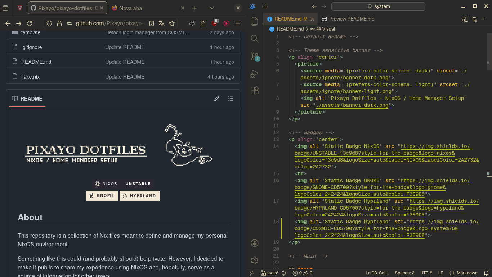

<!-- Default README -->

<!-- Theme sensitive banner -->
<p>
  <picture>
    <source media="(prefers-color-scheme: dark)" srcset="./assets/ignore/banner-dark.png">
    <source media="(prefers-color-scheme: light)" srcset="./assets/ignore/banner-light.png">
    
  </picture>


<!-- Badges -->
<p align="center">
  
  
  <br>
   
  
    


<!-- Main -->

## About

This repository is a collection of Nix files meant to define and manage my personal NixOS environment.

Something like this could (and probably should) be private. However, I decided to make it public to share my
experience using NixOS and, hopefully, serve as a source of information for other users.

<!-- Components table -->
<table align="center" style="width:50%">
  <thead>
    <tr>
      <th><div align="center">Components</div></th>
      <th><div align="center">Source</div></th>
    </tr>
  </thead>
  <tbody align="center">
    <tr>
      <td>Main desktop environment</td>
      <td><a href="https://www.gnome.org">GNOME</a></td>
    </tr>
    <tr>
      <td>Alternative environments</td>
      <td>HYPRLAND / COSMIC</td>
    </tr>
    <tr>
      <td>File Manager</td>
      <td><a href="https://yazi-rs.github.io/">Yazi</a></td>
    </tr>
    <tr>
      <td>Terminal emulator</td>
      <td><a href="https://github.com/alacritty/alacritty">Alacritty</a></td>
    </tr>
    <tr>
      <td>Shell</td>
      <td><a href="https://zsh.sourceforge.io">Zsh</a></td>
    </tr>
    <tr>
      <td>Editor</td>
      <td><a href="https://vscodium.com/">VSCodium</a></td>
    </tr>
    <tr>
      <td>Base16 scheme</td>
      <td><a href="https://github.com/warpdotdev/themes/blob/main/base16/base16_gruvbox_dark_hard.yaml">Gruvbox</a></td>
    </tr>
    <tr>
      <td>Styling framework</td>
      <td><a href="https://github.com/nix-community/stylix">Stylix</a></td>
    </tr>
  </tbody>
</table>

## Content

My system is intended to be portable and adaptable, supporting multiple users or just a single one. Many configurations are split into their own modules, which can be easily decoupled, overridden, or removed, while also providing a foundation for expansion and the creation of new modules.

### Repository structure

> **NOTE**: Sometimes I can just forget to update the readme and push a lot of crap to "main" without any explanation...

```text
├── assets
│   └── ...
│
├── data -> Metadata shared between "home-manager" and "nixos"
│   ├── aliases.nix
│   ├── default.nix
│   ├── env.nix
│   └── users.nix
│
├── home-manager -> standalone home-manager config
│   ├── flake.lock
│   ├── flake.nix
│   ├── home.nix
│   └── ...
│
├── nixos -> NixOS system configuration
│   ├── flake.lock
│   ├── flake.nix
│   ├── configuration.nix
│   ├── hardware-configuration.nix
│   └── ...
│
├── template -> reusable modules/structures
│   └── ...
│
└── flake.nix (ignore me, for now)
```

Both `nixos` and `home-manager` are independent, dividing home from system environment; however, they need
some shared metadata to function. You can find those in the `data` directory, and even change some attributes
for your own usage.

The `data/` directory is used in both system and home configurations. I use it to solve a very specific problem: **Sharing data between two independent** `flakes` **without bounding them.**

Why would you want to do that? For **portability**. You can reuse this configuration on other Linux
distributions using only the `data/` and `home-manager/` directories. If you later move back to NixOS, you can
reconnect everything with just a few minor adjustments.

The idea is that you can retain full control over your home/system config, building them separately, testing,
experimenting, and still be able to share data among them. Something that isn't possible without relying
on the NixOS Home Manager module integration (I can be wrong).

But how does it work? It is quite simple:

`data` feeds each `flake` with mutable data about the system/home environment, giving them some sort of
connection. Each `flake` then pins its own dependencies (`inputs`) like: `nixpkgs`, `stylix`, ... ;
essentially making the config itself generic... mostly... I am working on that...

You: "Alright, but what about the main `flake` in the repo..."

DON'T USE IT! I'm working on it...

### About wallpapers

The `wallpapers/` directory in `assets/` has wallpapers that I made myself with Aseprite, some of them are not
completely mine, but rather pixel art versions of other arts/characters.

The ones that are not 100% original have an initial `prefix` that can help identify the original artist or
source.

For example: `joyful-frog-wallpaper-...` will (probably) lead you to [this guy](https://www.youtube.com/channel/UCKdaljhUfgWil_fSm81iZCw) if you search for "joyful" or "joyful frog".

## Visual

All the visual identity of my setup comes from `home-manager` + `stylix`. You can see more details in `./home-manager/myDotfiles`.

### GNOME

<!-- Use a table for 2x2 grid display  -->
<table> 
  <tr>
    <td width="50%"></td>
    <td width="50%"></td>
  </tr>
  <tr>
    <td width="50%"></td>
    <td width="50%"></td>
  </tr>
</table>

### Hyprland (WIP)

...

### COSMIC (WIP)

...

## Installation

This setup is not ready (yet). If you are curious, the most relevant entry points are:

- `data/default.nix`
- `home-manager/flake.nix`
- `nixos/flake.nix`

If you know how flakes work, you can build my system yourself without many issues. Currently I am not
working on an installation script or guide, so you are (mostly) on your own, but at least I can give some
direction.

1. Flakes aren't sufficient, you need the `data/` directory or at least a modified copy of it. If you skip this step, you will need to overwrite a bunch of values both in `nixos/` and in `home-manager`.
2. You don't need both `nixos/` and `home-manager/` to be in the same directory, but make sure that they can access `data/`.
3. Try changing values in `data/`, for example: switch "desktop" from `GNOME` to `COSMIC` and see what it does.
4. You can find some of the commands listed in `data/aliases.nix` useful for rebuilding my system.
5. There are some comments scattered around. Go read them all!

## WIP