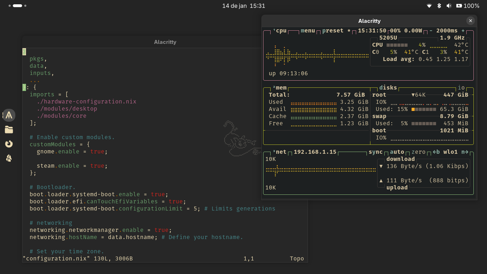
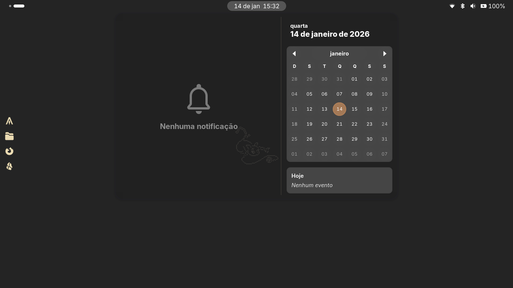

<!-- Default README -->

<!-- Theme sensitive banner -->
<p align="center">
  <picture>
    <source media="(prefers-color-scheme: dark)" srcset="./assets/ignore/banner-dark.png">
    <source media="(prefers-color-scheme: light)" srcset="./assets/ignore/banner-light.png">
    
  </picture>
</p>

<!-- Badges -->
<p align="center">
   * 
   
  
</p>

<!-- Main -->

## About

This repository is a collection of Nix files meant to define and manage my personal NixOS environment.

Something like this could (and probably should) be private. However, I decided to make it public to share my
experience using NixOS and, hopefully, serve as a source of information for other users.

## Content

My system is intent to be portable and adaptable, supporting multiple users or just a single one. Many configurations are split into their own modules, which can be easily decoupled, overridden, or removed, while also providing a foundation for expansion and the creation of new modules.

### Repository structure

> [!CAUTION]
> Sometimes I can just forget to update the readme and push a lot of crap to "main" without any explanation...

```text
├── assets
│   └── ...
├── data
│   ├── aliases.nix
│   ├── default.nix
│   ├── env.nix
│   └── users.nix
├── home-manager
│   ├── flake.lock
│   ├── flake.nix
│   ├── home.nix
│   └── ...
├── nixos
│   ├── flake.lock
│   ├── flake.nix
│   ├── configuration.nix
│   ├── hardware-configuration.nix
│   └── ...
├── template
│   └── ...
└── flake.nix (ignore me, for now)
```

Both `nixos` and `home-manager` are independent, dividing home from system environment; however, they need
some shared metadata to function. You can find those in the `data` directory, and even change some attributes
for your own usage.

The idea is that you can retain full control over your home/system config, building them separately, testing,
experimenting, and still be able to share data among them. Something that isn't possible without relying
on the NixOS Home Manager module integration (I can be wrong).

But how does it works? It is quite simple:

`data` feeds each `flake` with mutable data about the system/home environment, giving them some sort of
connection. Each `flake` then pins its own dependencies (`inputs`) like: `nixpkgs`, `stylix`, ... ;
essentially making the config itself generic... mostly... I am working on that...

You: "Alright, but, what about the main `flake` in the repo..."

DON'T USE IT! I'm working on it...

### About wallpapers

The `wallpapers/` directory in `assets/` has wallpapers that I made myself with Aseprite, some of them are not
completely mine, but rather pixel art versions of other arts/characters.

the ones that are not 100% original have an initial `prefix` that can identify the original artist or source.

For example: `joyful-frog-wallpaper-...` will (probably) lead you to [this guy](https://www.youtube.com/channel/UCKdaljhUfgWil_fSm81iZCw) if you search for "joyful" or "joyful frog".

## Visual

All the visual identity of my setup comes from `home-manager` + `stylix`. You can see more details in the `./home-manager/myDotfiles`.

### GNOME

<p align="center"> 
  
  
  
</p>

## Installation

> Work in progress...

## WIP